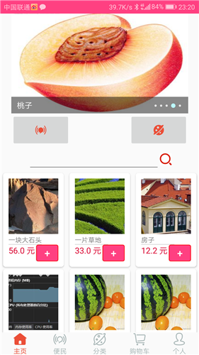
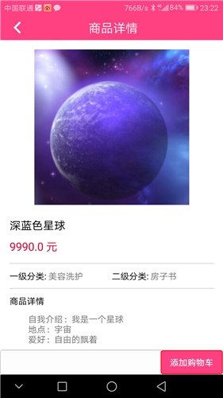
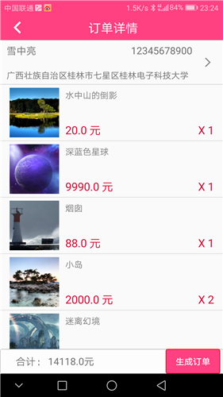
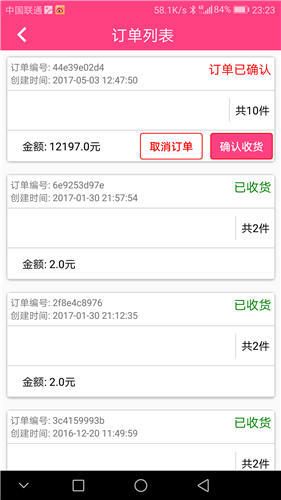
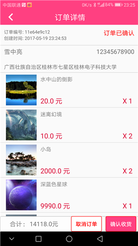
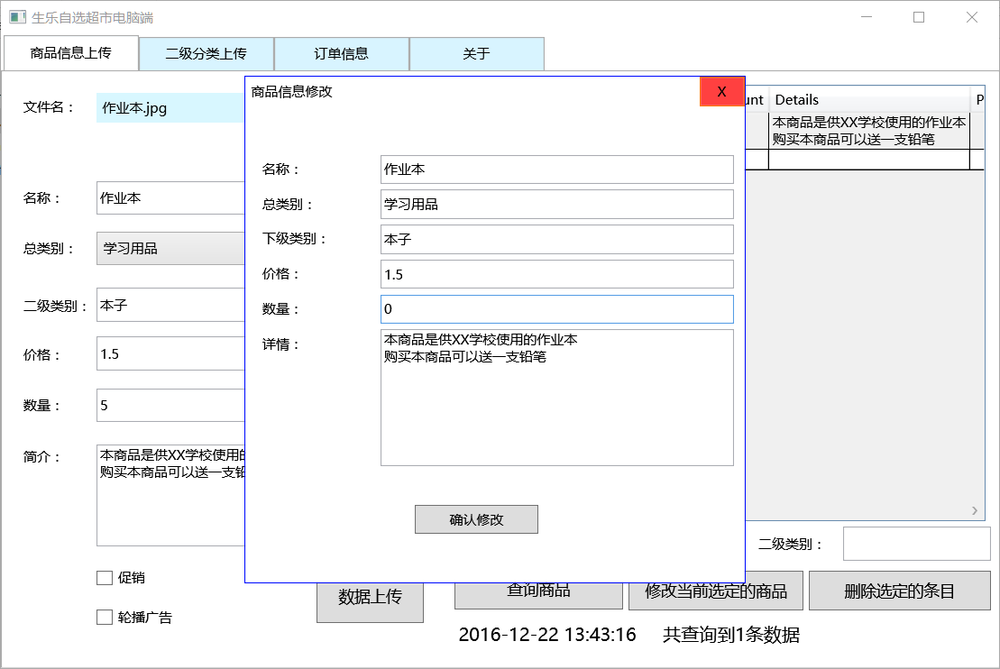
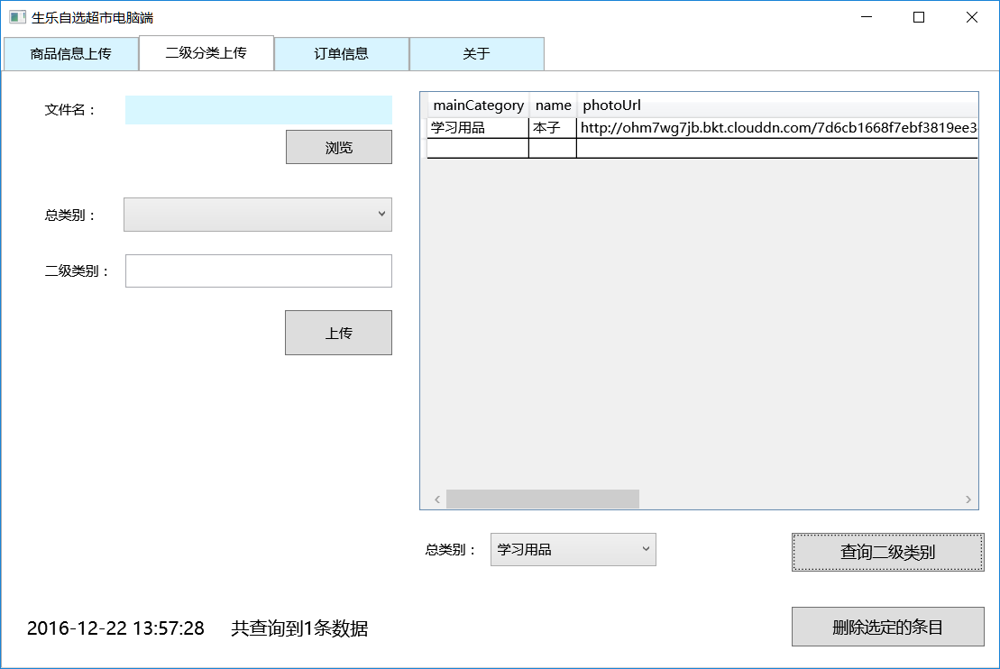

# 线上商品浏览及线下交易系统

## [功能说明](https://github.com/bitkylin/BitkyShop/wiki)

- 一套完整的线上商品浏览及线下交易系统

- 包括 Android 手机端「用户端」，.NET 电脑端「商家端」

- Android 手机端为一个完整的购物 App，已实现如下功能：分类展示商品，展示商品详情，添加购物车，添加并选择收件人信息，下单，查看订单详情，查看历史订单等

- 用户通过 App 浏览商品信息，选择有意向的商品提交订单信息

- 商家可通过电脑端实时查看用户所下的订单，并设置订单状态，和用户在线下完成商品交易后在系统中确认交易完成

- 商家可通过电脑端上传及修改商品信息，管理订单数据、及时接收用户的订单等

## [技术与架构](https://github.com/bitkylin/BitkyShop/wiki/%E6%8A%80%E6%9C%AF%E4%B8%8E%E6%9E%B6%E6%9E%84)

### 云服务

Android 手机端和 .NET 电脑端均使用如下云服务，并通过如下云服务进行交互：

- 「七牛云存储」保存商品图片，以外链形式

- 「Bomb 后端云」作为后端服务器，保存商品信息，用户信息，订单信息，收货人信息等各种数据

### Android 手机端

- API 级别 Android 4.4「API19」及以上，经过测试在 Android 5.1.1「API22」系统下运行良好

- 完整的购物 App，已实现分类展示商品，展示商品详情，添加购物车，添加并选择收件人信息，下单，查看订单详情，查看历史订单等

- 使用的技术点包括： Toolbar、RecyclerView、CardView、Tablayout、SwipeRefeshLayout、OKhttp、Fresco、Picasso、gson、自定义控件等

### .NET 电脑端

- 基于 .NET Framework 4.6.2 平台，WPF 框架，C# 语言

- 完善的商家管理端，商家可通过电脑端上传及修改商品信息，管理订单数据、及时接收用户的订单等

- 商家可通过电脑端实时查看用户所下的订单，并设置订单状态，和用户在线下完成商品交易后在系统中确认交易完成

## [Wiki](https://github.com/bitkylin/BitkyShop/wiki)

项目详情请参见 Wiki

### 1. [项目简介](https://github.com/bitkylin/BitkyShop/wiki)

### 2. [技术与架构](https://github.com/bitkylin/BitkyShop/wiki/技术与架构)

### 3. [商品信息上传](https://github.com/bitkylin/BitkyShop/wiki/商品信息上传)

### 4. [商品信息查询与修改](https://github.com/bitkylin/BitkyShop/wiki/商品信息查询与修改)

### 5. [订单信息查询与修改](https://github.com/bitkylin/BitkyShop/wiki/订单信息查询与修改)

## 项目展示

### Android 手机端

首页：展示热门商品信息以及广告轮播条

分类页面：对商品子类别进行分类展示

子类别页面：对商品进行更细化分类的展示

商品详情页面：详细展示单个商品的信息

订单确认页面：选择购物车商品并提交后对商品信息进行再次确认

订单列表：展示历史订单

单个订单详情：展示单个订单，并对订单进行操作

### .NET 电脑端

上传详细的商品信息

上传商品的二级分类「商品子类别」的详细信息

用户订单管理：查看并操作用户的订单

## [License](https://github.com/bitkylin/BitkyShop/blob/master/LICENSE)

> MIT License
> 
> Copyright (c) 2017 123lml123
> 
> Permission is hereby granted, free of charge, to any person obtaining a copy
> of this software and associated documentation files (the "Software"), to deal
> in the Software without restriction, including without limitation the rights
> to use, copy, modify, merge, publish, distribute, sublicense, and/or sell
> copies of the Software, and to permit persons to whom the Software is
> furnished to do so, subject to the following conditions:
> 
> The above copyright notice and this permission notice shall be included in all
> copies or substantial portions of the Software.
> 
> THE SOFTWARE IS PROVIDED "AS IS", WITHOUT WARRANTY OF ANY KIND, EXPRESS OR
> IMPLIED, INCLUDING BUT NOT LIMITED TO THE WARRANTIES OF MERCHANTABILITY,
> FITNESS FOR A PARTICULAR PURPOSE AND NONINFRINGEMENT. IN NO EVENT SHALL THE
> AUTHORS OR COPYRIGHT HOLDERS BE LIABLE FOR ANY CLAIM, DAMAGES OR OTHER
> LIABILITY, WHETHER IN AN ACTION OF CONTRACT, TORT OR OTHERWISE, ARISING FROM,
> OUT OF OR IN CONNECTION WITH THE SOFTWARE OR THE USE OR OTHER DEALINGS IN THE
> SOFTWARE.

## 关于我

### 1. 我的主页

名称|二级域名|原始地址
---|---|---
主页|http://bitky.cc|https://bitkylin.github.io
GitHub|http://github.bitky.cc|https://github.com/bitkylin
简书|http://js.bitky.cc|http://www.jianshu.com/u/bd2e386a6ea8
CSDN|http://csdn.bitky.cc|http://blog.csdn.net/llmmll08

### 2. 其他

- 兴趣方向: Java, Android, C#, JavaScript, Node.js, Kotlin 等

- Email: bitkylin@163.com
